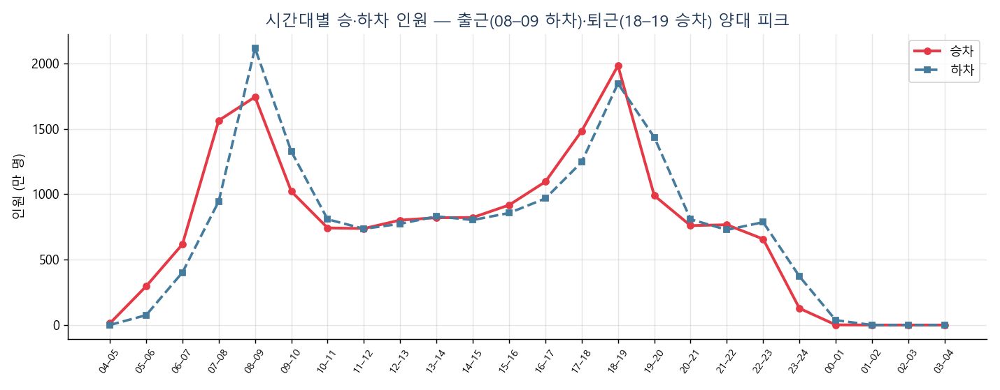
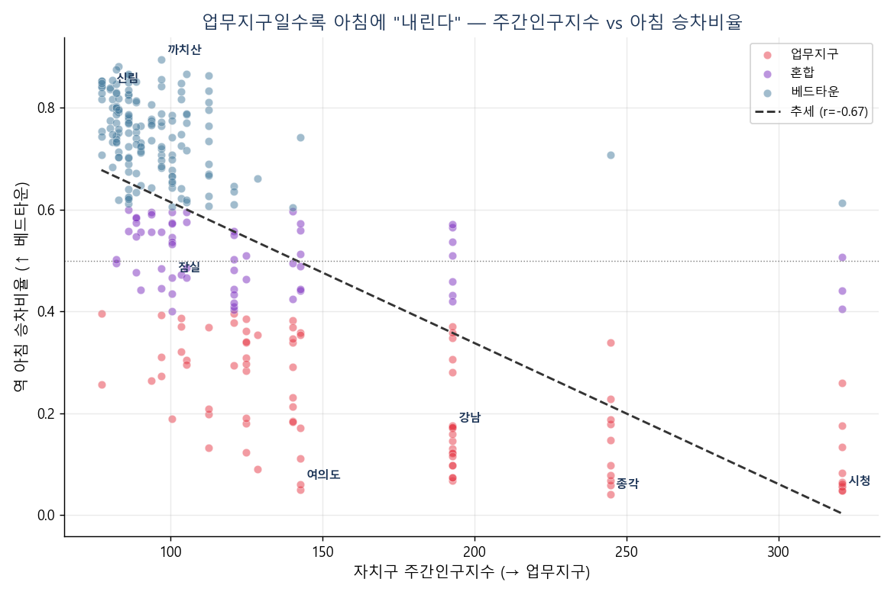

# 서울 지하철 혼잡도 분석 
> Timleven (T-XI)<br>
> 임유정 · 전경은 · 최용우 · 최동렬<br>
> 작성일 2026-06-26<br>
> 
> **운영 자원 배치를 위한 데이터 기반 혼잡 진단**
> 클라이언트(가상): 서울교통공사 운영·안전팀<br>

## 🎯 분석 목표
혼잡이 몰리는 **역 × 시간대 × 방향**을 찾아, 증차·인력을 **어디에 먼저 투입할지** 우선순위를 제시한다.

## 🔍 분석 접근 (Approach)

> **문제 인식 → 방법 설계 → 통계 검증 → 실행 제언**

| 단계 | 비중 | 핵심 |
|---|:---:|---|
| ① **문제 인식** | `30%` | 혼잡은 역·시간·방향마다 다른데 평균으론 안 보임 — 무엇을 풀지 정의 (SCQA) |
| ② **방법 설계** | `30%` | 혼잡 = 승차 + 하차로 역 × 시간 집계 · 출/퇴근·방향(주거 ↔ 업무) 분리 |
| ③ **통계 검증** | `20%` | 외부 Join(자치구 인구지수·기상) + 상관·유의성 검정 — 감 아닌 근거 |
| ④ **실행 제언** | `20%` | 역 × 시간 핫스팟 점수화 → 증차·인력 배치 우선순위 |

📐 보고: **SCQA · 피라미드**(바바라 민토) 구조 · **folium** 혼잡지도로 시각화

## 📊 핵심 결과 (Key Findings)

| 발견 | 내용 |
|---|---|
| ⏰ **양대 피크** | 출근 08–09시 **하차** · 퇴근 18–19시 **승차** 집중 |
| 🔄 **방향성** | 업무지구일수록 아침에 내림 — 주간인구지수 ↔ 아침승차비율 **r = −0.67** (p < 0.0001) |
| 📍 **핫스팟** | 출근 1위 가산디지털단지 83만 · 퇴근 1위 강남 88만 · **가산 = 양방향 슈퍼핫스팟** |
| 🌦️ **날씨 무관** | 기온·강수 상관 미미 — 코로나(2020)가 시계열 지배 (상관 ≠ 인과) |


> **시간대별 승·하차** — 출근 08–09 하차 / 퇴근 18–19 승차, 양대 피크


> **방향성 실증** — 업무지구(주간인구지수↑)일수록 아침에 내린다 · r = −0.67, p < 0.0001

## 📦 데이터
| 데이터 | 내용 | 출처 |
|---|---|---|
| 승하차 인원 | 시간대별 승·하차 (2015.01–2021.06, 45,338행, 서울 296역) | 서울 열린데이터광장 |
| 역 위치·주소 | 위·경도·주소 (지도·자치구 매핑 키) | 위치 데이터 |
| 주간인구지수 **· 외부 Join** | 자치구 주간/상주 인구비 — 방향성(업무/주거) 실증 | 공공데이터포털(통계청 2020) |
| 기온·강수 **· 외부 Join** | 월별 평균기온·강수 — 시계열(날씨 영향) | 기상청 (2015–2021 사용) |

> ⚠️ 원본 데이터(CSV)는 용량상 repo 미포함(`.gitignore`). 위 출처에서 받아 사용.

## 📁 폴더 구조
```
[T-XI] … (노트).ipynb   최종 분석 노트북 (제출용 · 결과 포함)
sub_data/      제출 데이터셋 (지하철 + 외부 Join용)
docs/          기획서 PDF (+ _src HTML 소스)
notebooks/     단계별 분석 노트북 ②~⑤
outputs/       차트 PNG · folium 혼잡지도(html)
report/        제출 보고서(PDF) · 발표자료(PPTX) + 소스
external_data/ 외부데이터(인구·기상) + 출처(SOURCES.md)
```

## ✅ 진행 현황
- [x] ① 기획 (문제 정의 · SCQA)
- [x] ② 데이터 로드
- [x] ③ EDA (시간대·호선·역·방향성)
- [x] ④ 심화 — 외부 Join · 방향성 통계검정 · 핫스팟
- [x] ⑤ 솔루션 — folium 지도 · 자원배치 권고
- [x] ⑥ 보고서 · 발표자료

## 📄 산출물
- 기획서 — `docs/[T-XI] 서울지하철_혼잡도분석 (기획서).pdf`
- 보고서 — `report/[T-XI] 서울지하철_혼잡도분석 (보고서).pdf`
- 발표자료 — `report/[T-XI] 서울지하철_혼잡도분석 (발표).pptx` (17장 · 비주얼 슬라이드)
- 분석 노트북 — `[T-XI] 서울지하철_혼잡도분석 (노트).ipynb` (보고서 흐름 통합 · 외부 Join 검증 · 차트 포함)
  - 단계별: `notebooks/` ②로드 ③EDA ④심화 ⑤솔루션
- folium 혼잡지도 — `outputs/혼잡지도.html`
- 제출 데이터셋 — `sub_data/` (노트북과 함께 실행)
